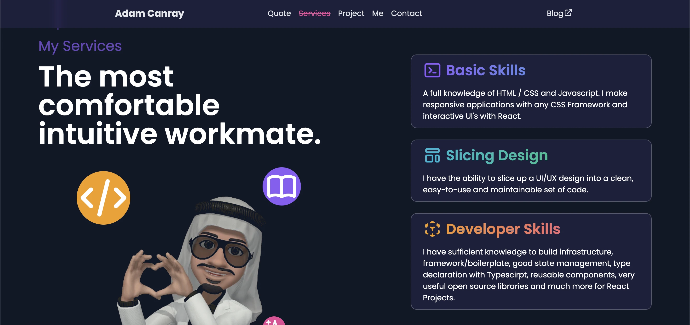

Hi there 👋

I'm a Software Engineer (#All #Things)

Interested in technological developments, programming, and how things work or happen 🚀

A former member of [Akatsukidev](https://imyours.vercel.app/queue?redirect_uri=https://github.com/akatsukidev)🥷🏽 who sealed [8-Tails Bijuu](https://imyours.vercel.app/queue?redirect_uri=https://naruto.fandom.com/wiki/Gy%C5%ABki) into the [Gedō Mazō](https://imyours.vercel.app/queue?redirect_uri=https://naruto.fandom.com/wiki/Demonic_Statue_of_the_Outer_Path)

My current goal is to collect all four [Road Poneglyphs](https://imyours.vercel.app/queue?redirect_uri=https://onepiece.fandom.com/wiki/Poneglyph) to find [One Piece](https://imyours.vercel.app/queue?redirect_uri=https://onepiece.fandom.com/wiki/One_Piece) and become the Pirate King👑. This will be a long adventure that is not easy. Therefore, I built a large fleet, namely the [Nakama DAO](https://imyours.vercel.app/queue?redirect_uri=https://nakama-dao.vercel.app/)🏴‍☠️ (Decentralized Autonomous Organization).

Say hi on [LinkedIn 👔](https://imyours.vercel.app/queue?redirect_uri=https://www.linkedin.com/in/adam-c-46a111188/)

## Let's Connect

  
  

## Further Projects

- [🐙 Octopus Waterfall](https://imyours.vercel.app/queue?redirect_uri=https://octopuswaterfall.web.app/) - Website for share quotes
- [🏴‍☠️ Nakama DAO](https://imyours.vercel.app/queue?redirect_uri=https://nakama-dao.vercel.app/) - Nakama DAO Member Page (Decentralized Autonomous Organization)
- [❤️ My Heart's Message](https://imyours.vercel.app/queue?redirect_uri=https://my-hearts-message.vercel.app/?fr=gh) - Transform Your Thoughts into Heartfelt Words with AI
- [💌 Heartfelt Letter Extension](https://imyours.vercel.app/queue?redirect_uri=https://github.com/adamcanray/heartfelt-letters-extension) - Let our AI Assistant Help You Express Your Love in the Most Romantic Way Possible
- [🤪 Silly Picture Generator](https://imyours.vercel.app/queue?redirect_uri=https://silly-picture-generator.vercel.app/) - Turn me into anyone you want! Make sure you refer to me as "aneld" in the prompt
- [📃 RusticLogger](https://imyours.vercel.app/queue?redirect_uri=https://github.com/adamcanray/rustic-logger) - A simple logging app built with Rust.
- [🛠️ ToolQuarry](https://imyours.vercel.app/queue?redirect_uri=https://github.com/orgs/toolquarry) - A platform for open-source developers to share and collaborate on their tools and utilities
- [🥷🏽 Shinobi Name Service](https://imyours.vercel.app/queue?redirect_uri=https://shinobi-name-service-web3.vercel.app/) - Unleash Your Digital Jutsu in the Blockchain Realm!
